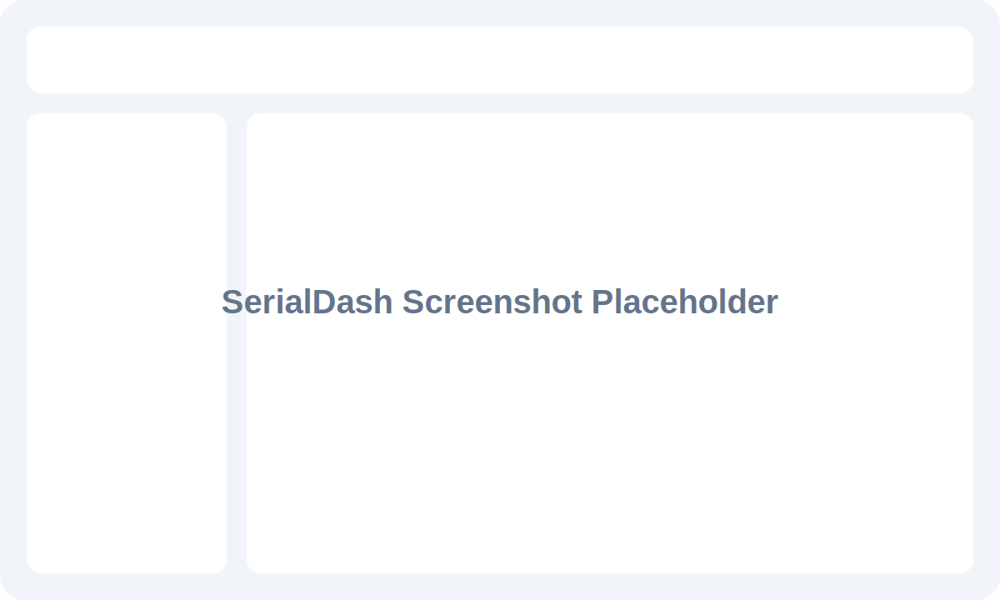

# SerialDash

SerialDash is a React + Vite dashboard for reading Web Serial data from Arduino-style devices and turning detected variables into draggable widgets.

## Run Locally

```bash
npm install
npm run dev
```

Open the local Vite URL in a supported browser, then click **Connect**.

## Supported Browsers

SerialDash uses the Web Serial API, so it is supported in:

- Google Chrome
- Microsoft Edge

Firefox and Safari do not currently support Web Serial for this app.

## Supported Serial Formats

CSV header followed by numeric rows:

```cpp
Serial.println("temp,humidity,pressure");
Serial.println("34.5,60.2,1013");
```

Key/value pairs:

```cpp
Serial.println("temp:34.5,humidity:60.2,pressure:1013");
```

Single numeric value:

```cpp
Serial.println("34.5");
```

For continuous Arduino output:

```cpp
void setup() {
  Serial.begin(9600);
  Serial.println("temp,humidity,pressure");
}

void loop() {
  Serial.print(34.5);
  Serial.print(",");
  Serial.print(60.2);
  Serial.print(",");
  Serial.println(1013);
  delay(500);
}
```

## Screenshot


